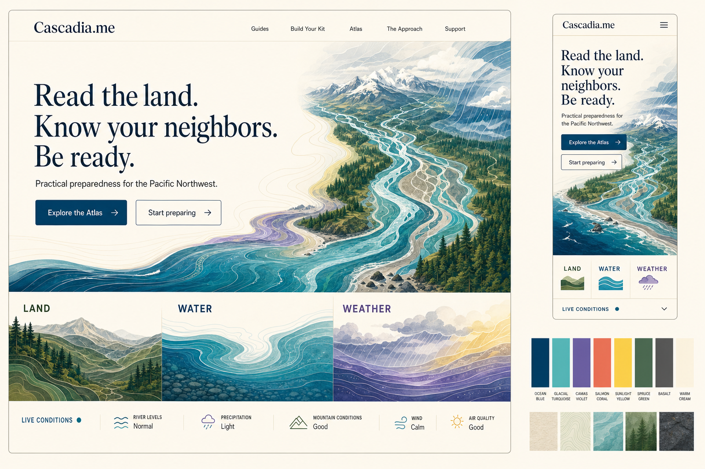
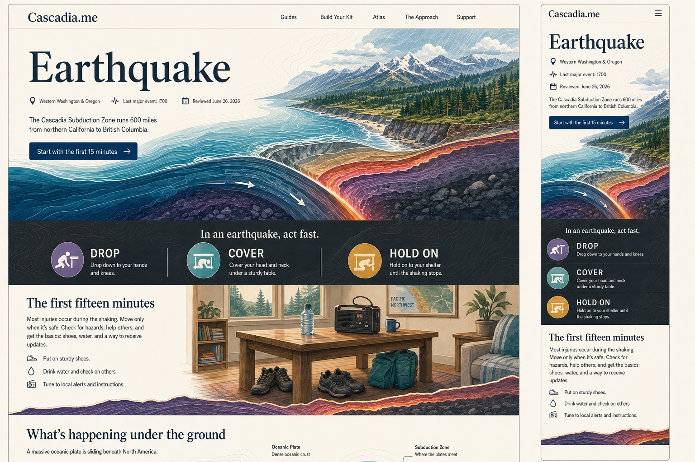
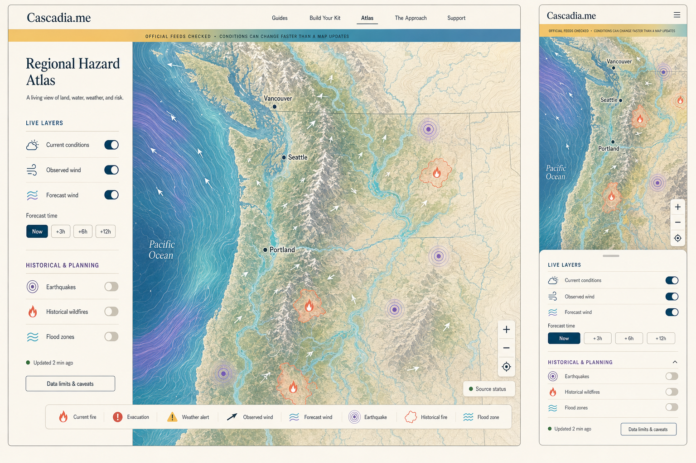
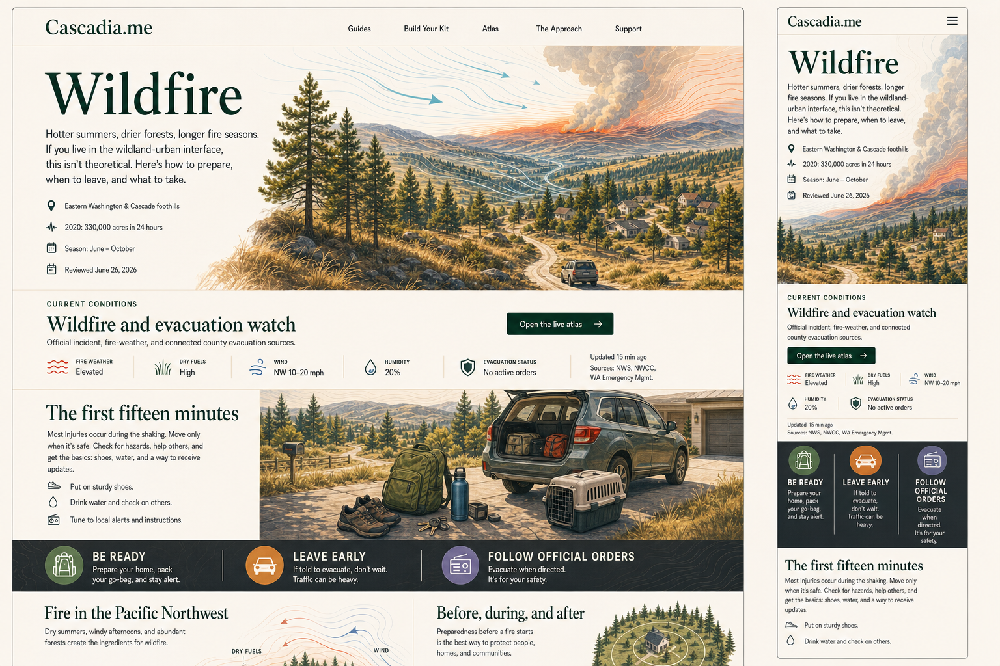
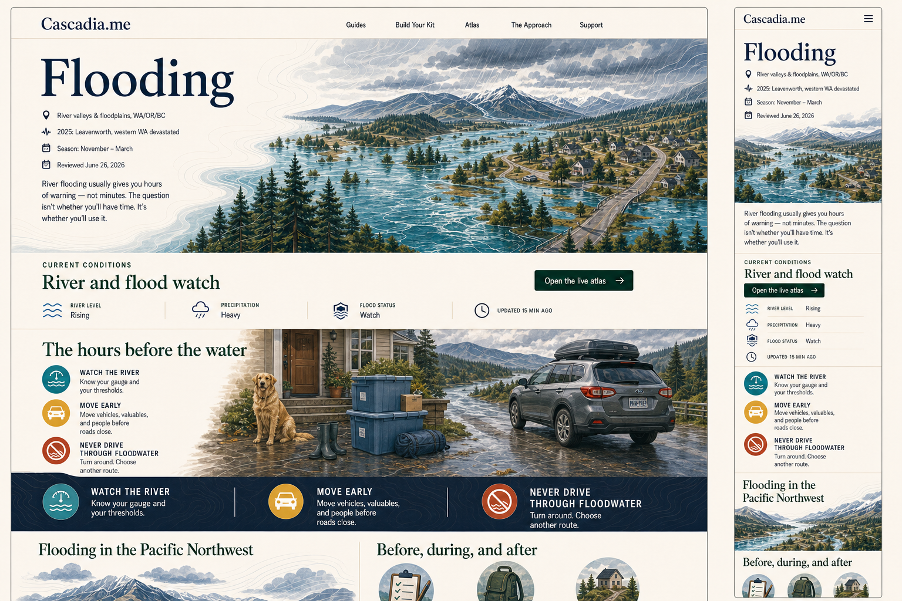
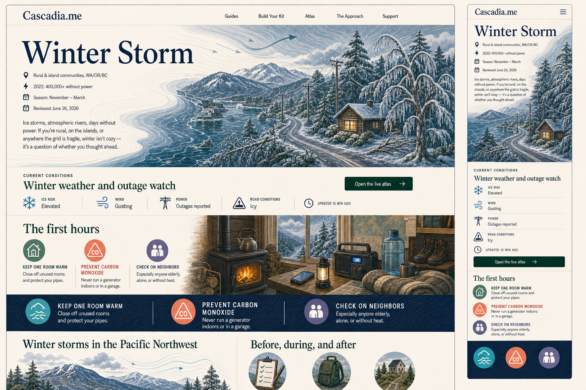

# Living Watershed

Living Watershed is the approved visual and editorial direction for Cascadia.me. This directory is the authoritative project package for carrying that direction through the site.

## Current status

- Visual direction selected: July 2026
- All existing concept and production artwork: locked by owner decision
- Phase 1, restore the editorial center: complete July 11, 2026
- Phase 2, rewrite the homepage as the prologue: complete July 11, 2026
- Phase 3, rebuild Earthquake as Chapter One: complete July 11, 2026
- Phase 4, write Wildfire, Flooding, and Winter Storm individually: complete July 11, 2026
- Phase 5, reframe Build Your Kit as the household workbook: complete July 11, 2026
- Phase 6, refine the Atlas as the regional instrument: complete July 11, 2026
- Phase 7, complete the book around the finished chapters, workbook, and instrument: complete July 11, 2026
- Phase 8, bind and audit the complete work end to end: complete July 12, 2026
- The complete site carries the version 0.8 bound and audited Living Watershed system
- ReadyPlan widgets: deferred until the modules and public/private boundaries are ready

The version 0.4 pages and production notes remain useful records of visual implementation, safety corrections, source handling, accessibility work, and data contracts. Their compact templates, repeated action bands, short-copy limits, and CTA-led structures are no longer authoritative.

## Governing belief

> **Preparedness isn't about fear. It's about care.**

Cascadia.me should feel written from within the region for adults who live here: richly illustrated, geographically observant, candid about risk and uncertainty, and useful without becoming another emergency-management publication.

The evidence may come from institutions. The voice comes from here.

## Authoritative files

Use these first:

1. [00-site-path.md](00-site-path.md) — the editorial constitution, page roles, narrative ethics, revised phases, and locked decisions
2. [01-visual-editorial-system.md](01-visual-editorial-system.md) — the shared editorial, visual, operational, safety, accessibility, and provenance specification
3. [artwork-register.md](artwork-register.md) — the locked baseline of every existing Living Watershed visual work
4. [concepts/](concepts/) — the six approved high-concept visual references

## Production records

These documents record completed implementation across phases 2–8. Preserve their factual, safety, source, accessibility, and technical decisions unless the governing documents explicitly replace them.

- [02-homepage.md](02-homepage.md) — completed Phase 2 prologue production record
- [03-guide-template-earthquake.md](03-guide-template-earthquake.md) — completed Phase 3 Earthquake chapter record
- [04-primary-guide-migrations.md](04-primary-guide-migrations.md) — completed Phase 4 Wildfire, Flooding, and Winter Storm production record
- [05-atlas.md](05-atlas.md) — completed Phase 6 Atlas production record and data contract
- [06-household-capabilities.md](06-household-capabilities.md) — completed Phase 5 household workbook record and ReadyPlan boundary
- [07-remaining-surfaces.md](07-remaining-surfaces.md) — current Guides, Approach, and wayfinding record
- [08-complete-site-audit.md](08-complete-site-audit.md) — final editorial, source, accessibility, geographic, responsive, and preservation audit
- [production-image-briefs.md](production-image-briefs.md) — historical generation briefs for completed, locked art; not an instruction to regenerate it

When an earlier production note conflicts with the editorial constitution or a later production record, the newer governing document wins.

## Locked artwork

The retained collection contains:

- 27 production compositions represented by 89 files under assets/living-watershed
- Six approved concept boards under docs/design/living-watershed/concepts
- 33 visual works represented by 95 files in total

Every work remains part of the project. It may be repositioned, scaled, captioned, or non-destructively presented for different viewports. It may not be deleted, replaced, regenerated, redrawn, recolored, renamed, overwritten, or destructively cropped without explicit owner approval.

The original home-lenses composition is included in the lock even though the current homepage uses the later home-lenses-fire composition.

## Production asset families

- assets/living-watershed — homepage artwork and social composition
- assets/living-watershed/earthquake — hero, household scene, process plate, responsive renditions, and social composition
- assets/living-watershed/wildfire — hero, household scene, process plate, responsive renditions, and social composition
- assets/living-watershed/flooding — hero, household scene, process plate, responsive renditions, and social composition
- assets/living-watershed/winter-storm — hero, household scene, process plate, responsive renditions, and social composition
- assets/living-watershed/kit — household-capability hero, household scene, responsive renditions, and social composition
- assets/living-watershed/surfaces — Guides and Approach artwork and the Guides social composition

The Atlas remains map-led. Its approved concept board establishes the treatment of live cartography, controls, source status, and caveats.

## Approved concept references

### Homepage

The visual north star: bold regional color, connected landscape, editorial scale, and an intimate relationship between illustration and information. Fire remains an explicit fourth lens in production.

### Earthquake

The canonical reference for landscape-scale geology, household life, explanatory illustration, and responsive reflow. Phase 3 now carries those roles into an immersive chapter without copying its structure into the other hazards.

### Regional Hazard Atlas

The map-specific exception: a live regional instrument with restrained controls, visible data classes, source status, and limitations.

### Wildfire

The reference for seasonal landscape, smoke and wind, household departure, and calm use of urgent color.

### Flooding

The reference for water as a legible physical system, threshold decisions, familiar roads, and early movement.

### Winter Storm

The reference for the cold-landscape and warm-household contrast, fragile infrastructure, outage life, and contained treatment of carbon-monoxide risk.

## Working rule

Living Watershed is an illustrated Cascadian reader with live instruments and a household workbook.

The prose is the spine. The artwork deepens it. Operational information supports it. Safety and evidence remain the invisible scaffolding.
